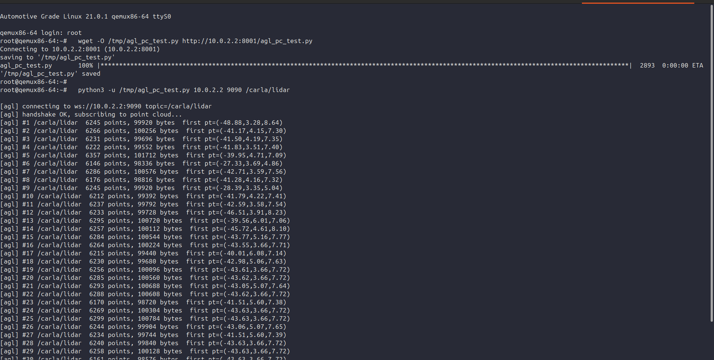
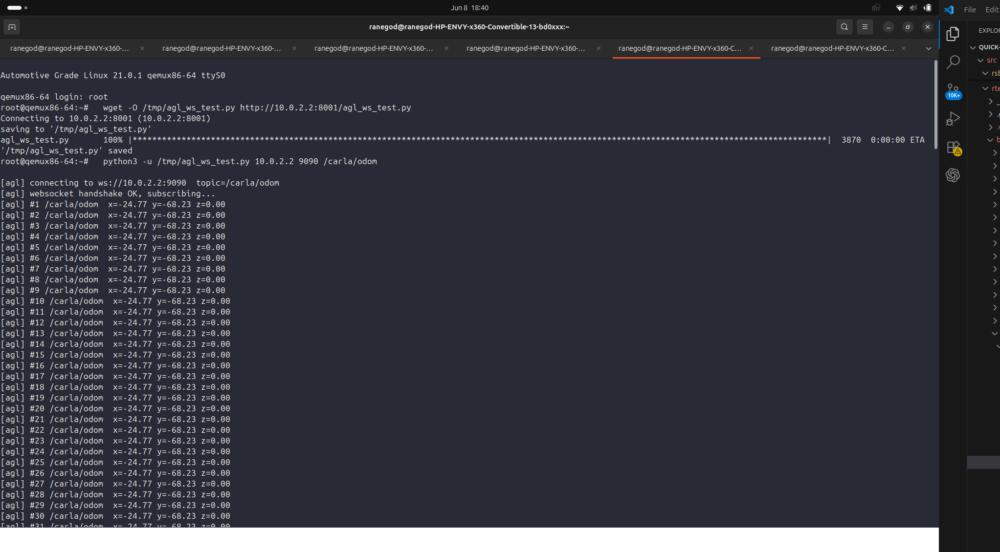

# AGL × CARLA — LiDAR Perception Pipeline

**GSoC 2026 · Automotive Grade Linux**
Streaming a live LiDAR point cloud from the [CARLA](https://carla.org) self-driving
simulator into an [Automotive Grade Linux](https://www.automotivelinux.org) (AGL)
dashboard, over ROS 2 and rosbridge — and running it all on a server with **no GPU**.

Contributor: Shaurya Rane · Mentors: Jan-Simon Möller, Rob Woolley

> 📝 Weekly write-up / blog: **https://github.com/shauryarane05/agl-gsoc-2026-blog**

---

## What this is

A car's LiDAR produces a 3D point cloud of the world around it. This project builds
the whole journey — in simulation, so it can be developed without a physical car:

```
CARLA simulator        →  virtual car + virtual LiDAR sensor
   │  point cloud (raw bytes over TCP)
   ▼
ROS 2 bridge           →  repacks into sensor_msgs/PointCloud2 on /carla/lidar
   │
   ├─► PCL perception (C++)  →  3D bounding boxes  (proof of concept)
   │
   ▼  rosbridge (WebSocket/JSON, :9090)
AGL dashboard / client →  receives the point cloud inside AGL
```

Every link in this repo runs on a **single GPU-less machine**: CARLA renders its
GPU ray-cast LiDAR on the CPU via Mesa's software Vulkan driver (`lavapipe`), and
AGL runs as a QEMU VM (`qemux86-64`).

## Proof

A live `/carla/lidar` point cloud arriving **inside the AGL VM** — ~5,700 points
(~91 KB) per frame, with real 3D coordinates that change as the simulated car drives:



Earlier milestone — ROS 2 `/carla/odom` topics visible on AGL:



---

## Repository layout

| Path | Runs on | What it does |
|------|---------|--------------|
| [`carla-bridge/`](carla-bridge/) | server (CARLA host) | CARLA → ROS 2 bridge: pulls LiDAR/odometry out of CARLA and publishes ROS 2 topics |
| [`agl-client/`](agl-client/) | inside the AGL VM | pure-stdlib rosbridge WebSocket clients that subscribe to the topics |
| [`perception_ws/`](perception_ws/) | server (ROS 2 env) | C++ PCL perception node — point cloud → 3D bounding boxes |
| [`docs/`](docs/) | — | proof screenshots |

### `carla-bridge/`
The bridge is **two processes** because CARLA's Python API only runs on Python 3.7
while ROS 2 (Humble) needs Python 3.10+ — they can't share an interpreter. They talk
over a local socket; the point cloud is sent as **raw bytes** (a cloud is far too
large to ship as JSON).

- `lidar_to_sock.py` — *(Py 3.7, CARLA env)* spawns an ego vehicle + ray-cast LiDAR,
  runs CARLA in synchronous mode, streams length-prefixed raw LiDAR bytes over TCP `:9871`.
- `sock_to_pointcloud2.py` — *(Py 3.10+, ROS 2 env)* reads those bytes, flips the Y
  axis (CARLA is left-handed, ROS is right-handed) and republishes them as
  `sensor_msgs/PointCloud2` on `/carla/lidar`.
- `lidar_probe.py` — standalone test that proved LiDAR works on the GPU-less server.
- `carla_to_udp.py` / `udp_to_ros2.py` — the earlier **odometry** bridge (JSON over UDP),
  kept for reference (`/carla/odom`).

### `agl-client/`
AGL isn't a ROS node, so it talks to **rosbridge** (ROS topics re-exposed as
WebSocket + JSON on `:9090`). These clients use only the Python standard library —
no ROS, no external deps — so they run on a minimal AGL image. From inside the QEMU
guest the host is reachable at `10.0.2.2`.

- `agl_pc_test.py` — subscribes to the raw point cloud `/carla/lidar` (decodes the
  base64 byte payload rosbridge sends).
- `agl_lidar_test.py` — subscribes to the PCL `/carla/detections` (3D boxes).
- `agl_ws_test.py` — the original odometry subscriber.

### `perception_ws/src/lidar_detector/`
A C++ `ament_cmake` ROS 2 package. Subscribes to `/carla/lidar` and runs a classic
PCL pipeline:

`VoxelGrid` downsample → `PassThrough` z-crop → `SACSegmentation` ground-plane removal
(RANSAC) → `EuclideanClusterExtraction` (KdTree) → axis-aligned 3D bounding boxes,
published as `vision_msgs/Detection3DArray` (`/carla/detections`) and green CUBE
markers (`/carla/detections_markers`). Typically 5–8 objects/frame.

> This node currently runs in a dev environment on the server. Embedding it *inside*
> the AGL image (the "ROS-Embedded" goal) is upcoming hardware work.

---

## Running it (high level)

On the server (one machine):

```bash
# 1. CARLA, headless, software Vulkan (no GPU needed)
export VK_ICD_FILENAMES=/usr/share/vulkan/icd.d/lvp_icd.json
export VK_DRIVER_FILES=/usr/share/vulkan/icd.d/lvp_icd.json
./CarlaUE4.sh -RenderOffScreen -vulkan -nosound -carla-rpc-port=2000

# 2. CARLA → TCP   (conda 'carla' env, Python 3.7)
python carla-bridge/lidar_to_sock.py

# 3. TCP → ROS 2 PointCloud2   (ROS 2 env, Python 3.10+)
python carla-bridge/sock_to_pointcloud2.py

# 4. expose ROS 2 over WebSocket
ros2 launch rosbridge_server rosbridge_websocket_launch.xml

# 5. (optional) PCL perception
cd perception_ws && colcon build && source install/setup.bash
ros2 run lidar_detector lidar_detector
```

Inside the AGL QEMU VM:

```bash
python3 agl_pc_test.py 10.0.2.2 9090 /carla/lidar
```

## Status

- ✅ Headless CARLA LiDAR on a GPU-less server (software Vulkan / `lavapipe`)
- ✅ Full pipeline CARLA → `/carla/lidar` (PointCloud2) → rosbridge → **AGL VM**
- ✅ PCL perception node producing 3D boxes (proof of concept)
- 🔜 Run on real hardware (Jetson Nano), embed perception in the AGL image,
  finalize detection/classification algorithms

## License

MIT — see [LICENSE](LICENSE).
